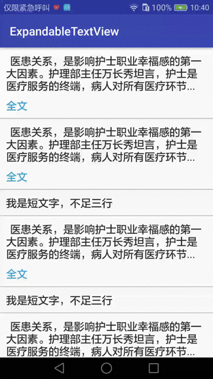

## ExpandableTextView
仿微信朋友圈全文、收起的TextView，可在RecyclerView和ListView中使用，不会有错乱和空白问题  

## 使用方法  
### 1、引入
在你项目module的build.gradle中加入  

	implementation 'com.devzld:expandlayout:1.0.0'  

### 2、使用 
你的实体类中加入一个是否展开的布尔型字段，例如： 
 
	data class TextBean(var text: String, var expand: Boolean)  

在recyclerview的item布局中按需声明如下：

	<com.zld.expandlayout.ExpandLayout
	    android:id="@+id/expand_layout"
	    android:layout_width="match_parent"
	    android:layout_height="wrap_content"
	    android:layout_marginBottom="8dp"
	    android:layout_marginTop="8dp"
	    app:collapseText="@string/foldHint"
	    app:contentTextColor="@color/text_color_normal"
	    app:contentTextSize="18sp"
	    app:ellipsizeText="..."
	    app:expandCollapseTextColor="#39a4d2"
	    app:expandCollapseTextGravity="right"
	    app:expandCollapseTextSize="16sp"
	    app:expandText="@string/expandHint"
	    app:maxCollapsedLines="3"
	    app:middlePadding="5dp"/>
	
在RecyclerView的onBindViewHolder方法中设置ExpandLayout的文字内容和展开状态，以及展开监听方法中将实体类的布尔型字段取反，同时调用notifyDataSetChanged()方法刷新列表  

	holder.expandLayout.setText(bean.text, bean.expand, object : ExpandLayout.OnExpandListener {
	            override fun expandChange() {
	                bean.expand = !bean.expand
	                notifyItemChanged(holder.adapterPosition)
	            }
	        })  

配置好以上，就OK了

### 3、XML中配置的属性说明

	

